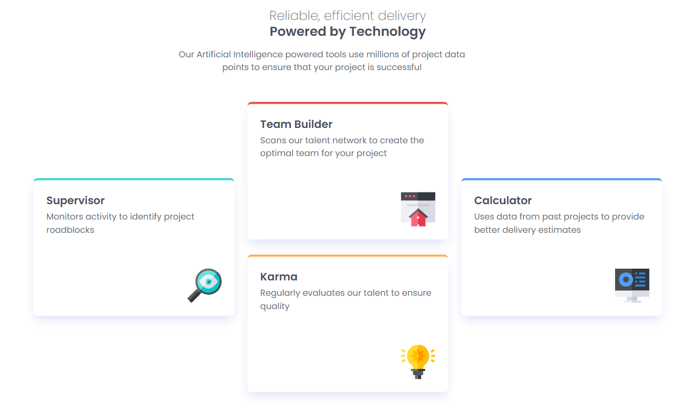

# Frontend Mentor - Four Card Feature Section Solution

This is my solution to the Four Card Feature Section challenge on Frontend Mentor. The goal of this project was to build a responsive feature section layout that adapts across different screen sizes while matching the provided design as closely as possible.

## Overview

### The Challenge

Users should be able to:

* View the optimal layout depending on their device's screen size.

### Screenshot



### Links

* Solution URL: https://www.frontendmentor.io/solutions/responsive-four-card-feature-section-using-tailwind-css-FoKB-O7UWi
* Live Site URL: https://fm-four-card-feature-tarkeshwar.netlify.app/

## My Process

### Built With

* Semantic HTML5
* Tailwind CSS
* CSS Grid
* Responsive Design
* Mobile-First Workflow
* Google Fonts (Poppins)

### What I Learned

This project helped me strengthen my understanding of CSS Grid and responsive layouts using Tailwind CSS.

Key learnings:

* Creating multi-column layouts using CSS Grid.
* Using grid row spans to position cards vertically.
* Extending the Tailwind configuration with custom colors and fonts.
* Building responsive layouts using Tailwind's breakpoint utilities.
* Organizing content using semantic HTML elements.

One concept I found particularly useful was using grid row spans to recreate the design layout:

```html
<div class="md:row-start-1 md:row-span-2">
```

I also learned how to extend Tailwind's theme configuration to create reusable design tokens:

```javascript
extend: {
  colors: {
    cyan: 'hsl(180, 62%, 55%)',
    red: 'hsl(0, 78%, 62%)',
    orange: 'hsl(34, 97%, 64%)',
    blue: 'hsl(212, 86%, 64%)'
  }
}
```

### Continued Development

In future projects I would like to continue improving:

* Advanced CSS Grid layouts.
* Tailwind CSS best practices.
* Accessibility and semantic HTML.
* Building reusable UI components.
* React + Tailwind integration.

### Useful Resources

* Frontend Mentor challenge brief
* Tailwind CSS Documentation
* MDN Web Docs
* CSS Grid Guide by CSS-Tricks

### AI Collaboration

I used ChatGPT as a learning assistant during this project.

AI was mainly used for:

* Reviewing my code structure.
* Understanding CSS Grid behavior.
* Improving responsiveness.
* Learning Tailwind CSS best practices.
* Getting feedback on accessibility and semantic HTML.

The project implementation and final design decisions were completed by me after understanding and applying the suggestions.

## Author

* Name: Tarkeshwar Uranw
* GitHub: https://github.com/tarkeshwaruranw
* Frontend Mentor: https://www.frontendmentor.io/profile/tarkeshwaruranw

## Acknowledgments

Thanks to Frontend Mentor for providing practical frontend challenges that help developers improve their HTML, CSS, Tailwind CSS, and responsive design skills through real-world projects.
